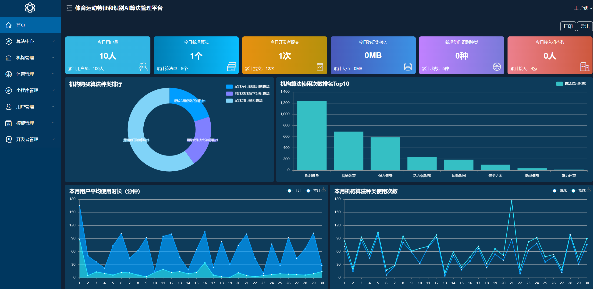

# 体态识别AI算法管理系统（Posture Body Recognition AI algorithm management system）

# ⛹🏻‍♀️🤸🏻‍♂️🏋🏻‍♂️🏊🏻‍♀️🚴🏻‍♂️💪🏻🦵🏻🤾🏻‍♀️🏇🏻



## 简介

体态识别AI算法管理系统 是AI体育识别的一部分,为AI在体育行业赋能,管理识别的算法,并搭配开发者中心pbr-developer实现开发者提交算法功能

## 环境

| 库/框架         | 版本     |
|--------------|--------|
| MySQL        | 8.0.33 |
| JDK          | 8      |
| Vue.js       | 2.x    |
| MyBatis Plus | 3.5.3  |
| Spring Boot  | 2.7.13 |
| Apache POI   | 5.0.0  |
| Lombok       | 1.18   |

## 快速开始

```shell 
tar -zxvf  algorithm-management-xxx.tar.gz
cd algorithm-management-xxx
sh bin/start.sh
```

## 代码审查

Alibaba Java Coding Guidelines


